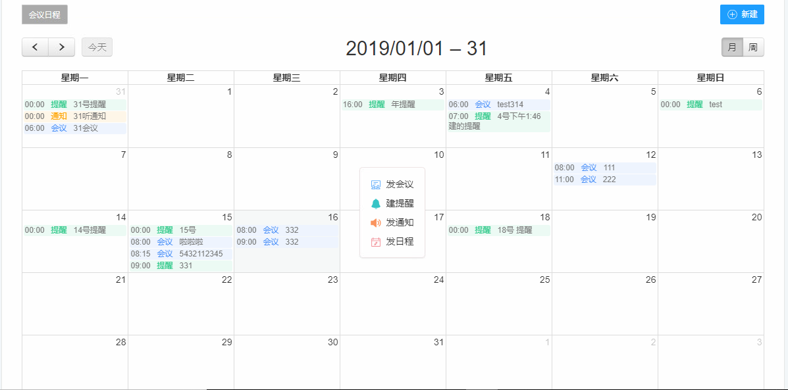

# fullCalendar 实现日程

引入fullCalendar相关JS和样式
``` html
<link href='${ctx}/plugin/fullcalendar/fullcalendar.min.css' rel='stylesheet' />
<link href='${ctx}/plugin/fullcalendar/fullcalendar.print.min.css' rel='stylesheet' media='print' />
<script src='${ctx}/plugin/fullcalendar/lib/moment.min.js'></script>
<script src='${ctx}/plugin/fullcalendar/fullcalendar.js'></script>
<script src='${ctx}/plugin/fullcalendar/locale/zh-cn.js'></script>
```

效果图


页面
``` html
<div id='calendar'></div>
````

JS
``` js
$('#calendar').fullCalendar({
  header: {
    left: 'prev,next today',
    center: 'title',
    right: 'month,agendaWeek'
  },
  buttonText:{
    'today':'今天',
    'month':'月',
    'week':'周',
    'day':'日'
  },
  dayClick: function(date,jsEvent,view) { 
    selectedDate = date;
    var top = $(this).offset().top - $("#meeting_wrap").offset().top + 20;
    var left = $(this).offset().left - $("#meeting_wrap").offset().left + 20;
    var scrollTop = $('.fc-scroller').scrollTop();
    if(view.name == 'agendaWeek'){
      $('#meeting_drop_menu').css({
        top:jsEvent.clientY - 100,
        left:left,
        right:'auto'
      })
    }else {
      $('#meeting_drop_menu').css({
        top:top,
        left:left,
        right:'auto'
      })
    }

    $('#meeting_drop_menu').show();
  },
  slotLabelFormat:"ah(:mm)点",
  minTime:"00:00",   //周视图、日视图最小显示时间
  maxTime:"24:00",    //周视图、日视图最大显示时间
  dayNames: ["星期日", "星期一", "星期二", "星期三", "星期四", "星期五", "星期六"],  
  dayNamesShort: ["星期日", "星期一", "星期二", "星期三", "星期四", "星期五", "星期六"],  
  titleFormat:"YYYY/MM/DD",
  defaultDate: new Date(),
  navLinks: true, // can click day/week names to navigate views
  selectable: false,
  selectHelper: true,
  allDaySlot:false,
  select: function(start, end) {
  },
  aspectRatio:1.9,
  editable: true,
  eventLimit: true, // allow "more" link when too many events
  events: function(start,end,timezone,callback){
    var params = {
      '<portlet:namespace/>beginTime':start.format(),
      '<portlet:namespace/>endTime':end.format()
    }
    $util.http.get('${workbenchllistURL}',params,function(data){
      var arr = [];
      if(data && data.length > 0){
        //workBentchType  5/个人提醒 2 //团队提醒 3 会议邀请  10 日程
        var backgroundColor = '#ecfaf4';
        var textColor = '#777777';
        var titleTypeText = '';
        var titleTextColer = '';
        $.each(data,function(index,item){
          if(item.workBentchType == 5){
            backgroundColor = '#ecfaf4'
            titleTypeText = '提醒';
            titleTextColer = '#2dc888';
          }else if(item.workBentchType == 2){
            backgroundColor = '#fff7e8';
            titleTypeText = '通知';
            titleTextColer = '#ffa400';
          }else if(item.workBentchType == 3){
            backgroundColor = '#eef5fe'
            titleTypeText = '会议';
            titleTextColer = '#488ff9';
          }else if(item.workBentchType == 10){
            backgroundColor = '#eef5fe'
            titleTypeText = '日程';
            titleTextColer = '#466ff9';
          }else {
            backgroundColor = '#eef5fe'
            titleTypeText = '';
            titleTextColer = '';
          }
          var endTime = Number(item.titleStartTime.split(':')[0]) + 1;
          endTime = endTime < 10 ? '0'+endTime+':00' : endTime+':00';

          var endTimeText = '';
          if(item.endDate){
            endTimeText = item.endDate.split(' ')[0]+'T'+item.endDate.split(' ')[1];
          }else {
            endTimeText = item.date+'T'+endTime;
          }
          arr.push({
            title:item.title,
            bid:item.bid,
            start:item.date+'T'+item.titleStartTime,
            end:endTimeText,
            backgroundColor:backgroundColor,
            borderColor:backgroundColor,
            textColor:textColor,
            workBentchType:item.workBentchType,
            titleTypeText:titleTypeText,
            titleStartTime:item.titleStartTime,
            titleTextColer:titleTextColer
          })
        })
      }
      console.log(arr);
      callback(arr);
    });
  },
  eventRender:function(event,element){
    var html = "<div><span>"+event.titleStartTime+"</span><span style='color:"+event.titleTextColer+";margin:0 10px;'>"+event.titleTypeText+"</span><span>"+event.title+"</span></div>"
    if(event.titleStartTime || event.titleTextColer || event.titleTypeText){
      element.html(html);
    }
  },
  eventClick:function(event, jsEvent, view){
    var type = event.workBentchType;

    switch (type){
      case '5':
        meetings.openRemindDetailModal(event.bid);
        break;
      case '3':
        meetings.openMeetingDetailModal(event.bid);
        break;  
      case '2':
        meetings.openTeamRemindDetailModal(event.bid);
        break; 
      case '10':
      meetings.openScheduleDetailModal(event.bid);
      break;
    }
  }
});
```