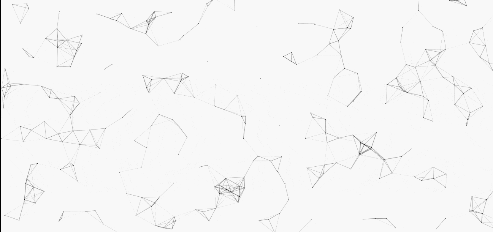

# canvas 实现粒子特效

效果图：



代码：
```js
<!DOCTYPE html>
<html lang="en">
<head>
    <meta charset="UTF-8">
    <title>particle nets</title>
    <style>
        html,body{
            margin: 0;
            padding: 0;
            height: 100%;
            overflow: hidden;}
    </style>
</head>
<body>
<canvas id="cas"></canvas>

<script>
    var canvas = document.getElementById("cas");
    var ctx = canvas.getContext("2d");
    resize();
    window.onresize = resize;
    function resize(){
        canvas.width = window.innerWidth || document.documentElement.clientWidth || document.body.clientWidth;
        canvas.height = window.innerHeight || document.documentElement.clientHeight || document.body.clientHeight;
    }
    var RAF = (function () {
        return window.requestAnimationFrame || window.webkitRequestAnimationFrame || window.mozRequestAnimationFrame || window.oRequestAnimationFrame || window.msRequestAnimationFrame || function (callback) {
                    window.setTimeout(callback, 1000 / 60);
                };
    })();
    // 鼠标活动时，获取鼠标坐标
    var warea = {x: null, y: null, max: 20000};
    window.onmousemove = function(e){
        e = e || window.event;
        warea.x = e.clientX;
        warea.y = e.clientY;
    };
    window.onmouseout = function(e){
        warea.x = null;
        warea.y = null;
    };
    // 添加粒子
    // x，y为粒子坐标，xa, ya为粒子xy轴加速度，max为连线的最大距离
    var dots = [];
    for(var i=0;i<300;i++){
        var x = Math.random()*canvas.width;
        var y = Math.random()*canvas.height;
        var xa = Math.random() * 2 - 1;
        var ya = Math.random() * 2 - 1;
        dots.push({
            x: x,
            y: y,
            xa: xa,
            ya: ya,
            max: 6000
        })
    }
    // 延迟100秒开始执行动画，如果立即执行有时位置计算会出错
    setTimeout(function(){
        animate();
    }, 100);
    // 每一帧循环的逻辑
    function animate(){
        ctx.clearRect(0,0,canvas.width, canvas.height);
        // 将鼠标坐标添加进去，产生一个用于比对距离的点数组
        var ndots  = [warea].concat(dots);
        dots.forEach(function(dot){
            // 粒子位移
            dot.x += dot.xa;
            dot.y += dot.ya;
            // 遇到边界将加速度反向
            dot.xa *= (dot.x > canvas.width || dot.x < 0)? -1 : 1;
            dot.ya *= (dot.y > canvas.height || dot.y < 0)? -1 : 1;
            // 绘制点
            ctx.fillRect(dot.x - 0.5, dot.y - 0.5, 1, 1);
            // 循环比对粒子间的距离
            for (var i = 0; i < ndots.length; i++) {
                var d2 = ndots[i];
                if (dot === d2 || d2.x === null || d2.y === null) continue;
                var xc = dot.x - d2.x;
                var yc = dot.y - d2.y;
                // 两个粒子之间的距离
                var dis = xc * xc + yc * yc;
                // 距离比
                var ratio;
                // 如果两个粒子之间的距离小于粒子对象的max值，则在两个粒子间画线
                if(dis < d2.max){
                    // 如果是鼠标，则让粒子向鼠标的位置移动
                    if (d2 === warea && dis > (d2.max / 2)) {
                        dot.x -= xc * 0.03;
                        dot.y -= yc * 0.03;
                    }
                    // 计算距离比
                    ratio = (d2.max - dis) / d2.max;
                    // 画线
                    ctx.beginPath();
                    ctx.lineWidth = ratio/2;
                    ctx.strokeStyle = 'rgba(0,0,0,' + (ratio + 0.2) + ')';
                    ctx.moveTo(dot.x , dot.y);
                    ctx.lineTo(d2.x , d2.y);
                    ctx.stroke();
                }
            }
            // 将已经计算过的粒子从数组中删除
            ndots.splice(ndots.indexOf(dot), 1);
        });
        RAF(animate);
    }
</script>
</body>
</html>
```