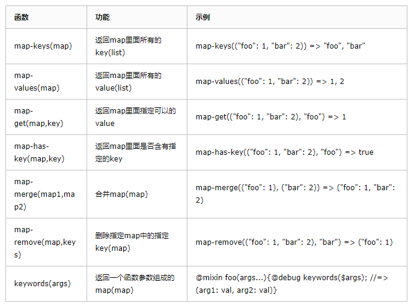

# sass 整理
**一.sass是什么？**
- Sass是成熟、稳定、强大的CSS预处理器，而SCSS是Sass3版本当中引入的新语法特性，完全兼容CSS3的同时继承了Sass强大的动态功能。

```
**基本语法**
- 1）变量
变量用来存储需要在CSS中复用的信息，例如颜色和字体。SASS通过$符号去声明一个变量。
example：
``` md
  //sass 样式
  $red: #f00;
  div {
     color: $red;
  }
  // 编译为css后
  div {
      color:#f00;
  }
```
- 特殊变量：如果变量嵌套在字符串中，则需要写在 #{} 符号里面，如：
``` md
  $top: top;
  div {
      margin-#{$top}: 10px;       /* margin-top: 10px; */
  }
```
- 默认变量：仅需在值后面加入 !default即可， 默认变量一般用来设置默认值，当该变量出现另外一个值时，
无论定义先后，都会使用另外一个值，覆盖默认值
``` md
  $color: red;
  $color: blue !default;
  div {
      color: $color;    /* color:red; */
  }
```
- 多值变量：多值变量分为list类型和map类型，list有点像js对象中的数组，map类型像js中的对象

- 1）list : 可通过空格，逗号或小括号分割多个值，使用 nth($变量名, $索引)取值。 list数据操作有其他函数，具体参考sass Functions
``` md
//一维数据
$px: 5px 10px 20px 30px;

//二维数据，相当于js中的二维数组
$px: 5px 10px, 20px 30px;
$px: (5px 10px) (20px 30px);

// 例子
$px: 10px 20px;
div {
    margin:nth($px, 1) 0 0 nth($px, 2);    /* margin:10px 0 0 20px; */
}
```
map: 数据以key和value组成，格式：$map: (key1: value1, key2: value2); map相关的函数有map-keys()、map-values()、map-get()、map-has-key()、map-merge()、map-remove()、keywords()等，情况图解

``` md
//SCSS
$social-colors: (
    dribble: #ea4c89,
    facebook: #3b5998,
    github: #171515,
    google: #db4437,
    twitter: #55acee
);
@each $name in map-keys($social-colors){
    .btn-#{$name}{
        color: colors($name);
    }
}
```
- 2）计算功能
- sass允许使用算式。
``` md
div {
    padding: 2px * 4px;
    margin: (10px / 2);
    font-size: 12px + 4px;
}
```
- 3）嵌套
- 标签嵌套
``` md
// sass 样式
div {
    color: #333;
    a {
       font-size:14px;
       &:hover {
          text-decoration:underline;
       }
    }
}

// 编译后css
div {
    color: #333;
}
div a {
    font-size:14px;
}
div a:hover {
    text-decoration:underline;
}
```
- 属性嵌套：
``` md
//sass 样式
.fakeshadow {
  border: {
    style: solid;
    left: {
      width: 4px;
      color: #888;
    }
    right: {
      width: 2px;
      color: #ccc;
    }
  }
}

//css 编译后样式
.fakeshadow {
  border-style: solid;
  border-left-width: 4px;
  border-left-color: #888;
  border-right-width: 2px;
  border-right-color: #ccc;
}
```
- 4）注释
sass有两种注释风格

标准css注释： /* 注释 */， 会保留到编译后的文件中，压缩则删除

单行注释： // 注释

在标准注释 /*后面加入一个感叹号，表示重要注释，压缩模式也会保留注释，用于版权声明等。
``` md
/*! 重要注释 */
```
- 5）继承
sass 中，选择器继承可以让选择器继承另一个选择器的所有样式
``` md
// sass样式
h1 {
    font-size:20px;
}
div {
    @extend h1;
    color:red;
}
// css编译后样式
h1 {
    font-size:20px;
}
div {
    font-size:20px;
    color:red;
}
```
使用占位符选择器 %
- 从sass3.2.0后，就可以定义占位选择器%，这个的优势在于，不调用不会有多余的css文件
``` md
// sass样式
%h1 {
    font-size:20px;
}
div {
    @extend %h1;
    color:red;
}
// css编译后样式
div {
    font-size:20px;
    color:red;
}
```
- 6）混合(mixin)
``` md
//sass 样式
@mixin opacity($opacity:50) {
  opacity: $opacity / 100;
  filter: alpha(opacity=$opacity);
}

.opacity{
  @include opacity;      //参数使用默认值  50/100 = 0.5
}
.opacity-80{
  @include opacity(80); //传递参数  80/100 = 0.8
}

//  css编译后样式
.opacity{
  opacity: 0.5;
  filter: alpha(opacity=50);
}

// ---------------------

// 多参数
@mixin center($width, $height) {
    position: absolute;
    left:50%;
    top:50%;
    width:$width;
    height:$height;
    margin:(-$height / 2) 0 0 (-$width / 2);
}
div {
    @include center(200px, 100px);
}
// css编译后样式
div {
    position: absolute;
    left:50%;
    top:50%;
    width:200px;
    height:100px;
    margin:-50px 0 0 -100px;
}

// -------------------

//多组值
@mixin box-shadow($shadow...) {
    -webkit-box-shadow: $shadow;
    box-shadow: $shadow;
}
div {
    @include box-shadow(0 1px 0 rgba(0,0,0,.4), 0 -1px 1px rgba(0,0,0,.4));
}
// css编译后样式
div {
    -webkit-box-shadow: 0 1px 0 rgba(0,0,0,.4), 0 -1px 1px rgba(0,0,0,.4);
    box-shadow: 0 1px 0 rgba(0,0,0,.4), 0 -1px 1px rgba(0,0,0,.4);
}
```
- @content：在sass3.2.0中引入， 可以用来解决css3中 @meidia 或者 @keyframes 带来的问题。它可以使@mixin接受一整块样式，接收的样式从@content开始
``` md
//sass 样式
@mixin max-screen($res){
  @media only screen and ( max-width: $res )
  {
    @content;
  }
}

@include max-screen(480px) {
  body { color: red }
}

//css 编译后样式
@media only screen and (max-width: 480px) {
  body { color: red }
}
```
 使用@content解决@keyframes关键帧的浏览器前缀问题
``` md
// 初始化变量
$browser: null;
// 设置关键帧
@mixin keyframes($name) {
    @-webkit-keyframes #{$name} {
        $browser: '-webkit-'; @content;
    }
    @-moz-keyframes #{$name} {
        $browser: '-moz-'; @content;
    }
    @-o-keyframes #{$name} {
        $browser: '-o-'; @content;
    }
    @keyframes #{$name} {
        $browser: ''; @content;
    }
}

// 引入
@include keyframes(scale) {
    100% {
        #{$browser}transform: scale(0.8);
    }
}

// css编译后
@-webkit-keyframes scale {
    -webkit-transform: scale(0.8);
}
@-moz-keyframes scale  {
   -moz-transform: scale(0.8);
}
@-o-keyframes scale  {
    -o-transform: scale(0.8);
}
@keyframes scale  {
    transform: scale(0.8);
}
```
- 7）颜色函数
sass提供了一些内置的颜色函数
``` md
lighten(#cc3, 10%)　　  // #d6d65c
darken(#cc3, 10%) 　　　// #a3a329
grayscale(#cc3) 　　　　// #808080
complement(#cc3) 　　　// #33c
```
- 8）引入外部文件
使用 @import 命令引入外部文件， 引入后，可使用外部文件中的变量等。
``` md
@import "_base.scss";
```


**二.sass能做什么？**
- 可针对项目封装公共样式，公共属性，从而将复杂的css样式设计简单化，统一化处理；

**三.sass使用方式？**
- 1)基于ruby，需要安装ruby进行编译；
- 2)第三方工具编译sass，如koala等；
- 3)vue-cli可选择自动安装编译；

**四.sass我还能怎么用？高级用法**
- 结合vue项目开发时使用提高效率
- **高级用法：**
- 1）函数 function
sass允许用户编写自己的函数，以@function开始
``` md
$fontSize: 10px;
@function pxTorem($px) {
    @return $px / $fontSize * 1rem;
}
div {
    font-size: pxTorem(16px);
}
// css编译后样式
div {
    font-size: 1.6rem;
}
```
- 2）if条件语句
@if语句可以用来判断
``` md
// sass样式
$type: monster;
div {
    @if $type == ocean {
        color: blue;
    } @else if $type == matador {
        color: red;
    } @else if $type == monster {
        color: green;
    } @else {
        color: black;
    }
}
// css编译后样式
div {
    color: green;
}
```
**三目判断：语法为 if($condition, $if_true, $if_false)。 三个参数分别表示： 条件，条件为真的值，条件为假的值**
``` md
if(true, 1px, 2px) => 1px
if(false, 1px, 2px) => 2px
```
- 3）循环语句
for循环有两种形式，分别为：@for $var from <start> through <end> 和 @for $var from <start> to <end>。 $var 表示变量，start表示开始值，end表示结束值，两种形式的区别在于 through 包括 end 的值，to 不包括 end 值。
``` md
// sass样式
@for $i from 1 to 4 {
    .item-#{$i} {width: 2em * $i;}
}
// css编译后样式
.item-1 {
    width: 2em;
}
.item-2 {
    width: 4em;
}
.item-3 {
    width: 6em;
}
```
**while循环 **
``` md

// sass样式
$i: 2;
@while $i > 0 {
    .item-#{$i} {width: 2em * $i;}
    $i: $i - 1;
}
// css编译后样式
.item-2 {
  width: 4em;
}
.item-1 {
  width: 2em;
}
```
**@each循环：**
语法为@each $var in <list or map>。 其中$var表示变量，而list和map表示数据类型，sass3.3.0新加入多字段循环和map数据循环
单字段list数据循环
``` md
//sass 样式
$animal-list: puma, sea-slug, egret;
@each $animal in $animal-list {
  .#{$animal}-icon {
    background-image: url('/images/#{$animal}.png');
  }
}
//css 编译后样式
.puma-icon {
  background-image: url('/images/puma.png');
}
.sea-slug-icon {
  background-image: url('/images/sea-slug.png');
}
.egret-icon {
  background-image: url('/images/egret.png');
}
```
多字段list数据循环
``` md
//sass 样式
$animal-data: (puma, black, default),(sea-slug, blue, pointer);
@each $animal, $color, $cursor in $animal-data {
  .#{$animal}-icon {
    background-image: url('/images/#{$animal}.png');
    border: 2px solid $color;
    cursor: $cursor;
  }
}
//css 编译后样式
.puma-icon {
  background-image: url('/images/puma.png');
  border: 2px solid black;
  cursor: default;
}
.sea-slug-icon {
  background-image: url('/images/sea-slug.png');
  border: 2px solid blue;
  cursor: pointer;
}
```
多字段map数据循环
``` md
//sass 样式
$headings: (h1: 2em, h2: 1.5em, h3: 1.2em);
@each $header, $size in $headings {
  #{$header} {
    font-size: $size;
  }
}
//css 编译后样式
h1 {
  font-size: 2em;
}
h2 {
  font-size: 1.5em;
}
h3 {
  font-size: 1.2em;
}
```

**五.sass的优缺点有哪些？**
- 优点：高效开发，结构清晰，便于扩展
- 缺点：须要编译。无论是放在客户端还是服务器端，都是一种额外的花销

**六.同类东西 这个东西具有啥优势？**
- Less是基于JavaScript，是在客户端处理的。
- Sass是基于Ruby的，是在服务器端处理的。
- 目前优势个人觉得sass更强大一些

***Less和Sass在语法上有些共性，比如下面这些：***
1. 混入(Mixins)——class中的class；
2. 参数混入——可以传递参数的class，就像函数一样；
3. 嵌套规则——Class中嵌套class，从而减少重复的代码；
4. 运算——CSS中用上数学；
5. 颜色功能——可以编辑颜色；
6. 名字空间(namespace)——分组样式，从而可以被调用；
7. 作用域——局部修改样式；
8. JavaScript 赋值——在CSS中使用JavaScript表达式赋值。
