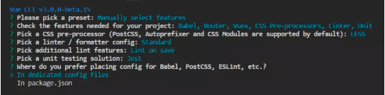

# vue-cli3创建项目
- Vue CLI是一个用于快速Vue.js开发的完整系统
- 3.X较2.X结构变了很多，更优雅，开发体验更好
``` md
- 安装
npm install -g @vue/cli

- 查看已安装版本
vue --version 或者 vue -V

- 卸载
npm uninstall @vue/cli

- 新建项目
vue create my-project

- 项目启动
npm run serve

- 打包
npm run build
```
**一、自定义安装项目noevue：**
1.vue create crm-vue

**二、安装流程**

- 2.1.选择Manually select features


- 2.2.选择项目需要的一些特性（此处我们选择需要Babel编译、使用Vue路由、Vue状态管理器、CSS预处理器、代码检测和格式化、以及单元测试，暂时不考虑端到端测试(E2E Testing)）


- 2.3.选择CSS预处理器语言，此处选择LESS


- 2.4.选择ESLint的代码规范，此处使用 Standard代码规范


- 2.5.选择何时进行代码检测，此处选择在保存时进行检测


- 2.6.选择单元测试解决方案，此处选择 Jest


- 2.7.选择 Babel、PostCSS、ESLint等配置文件存放位置，此处选择单独保存在各自的配置文件中


- 2.8.配置完成后等待Vue-cli完成初始化


- 2.9.vue-cli初始化完成后，根据提示，进入到vue-test项目中，并启动项目
>>
